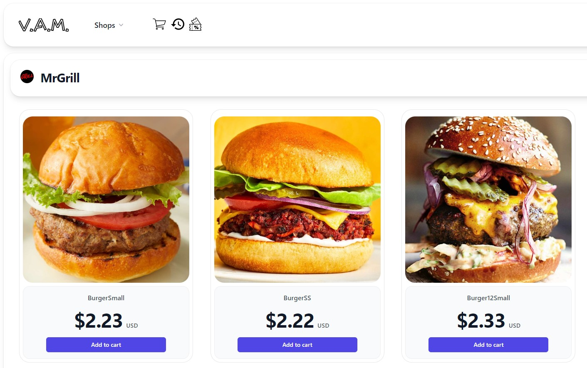
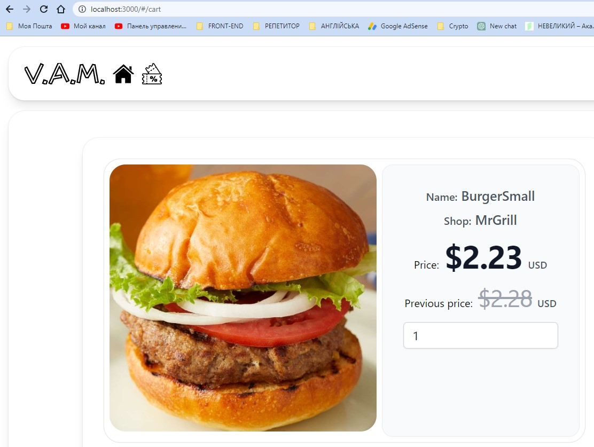
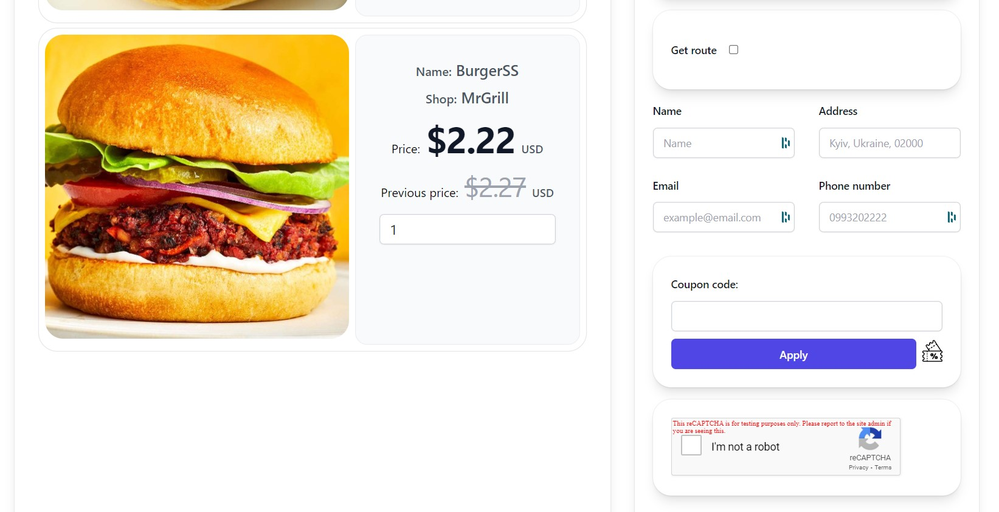
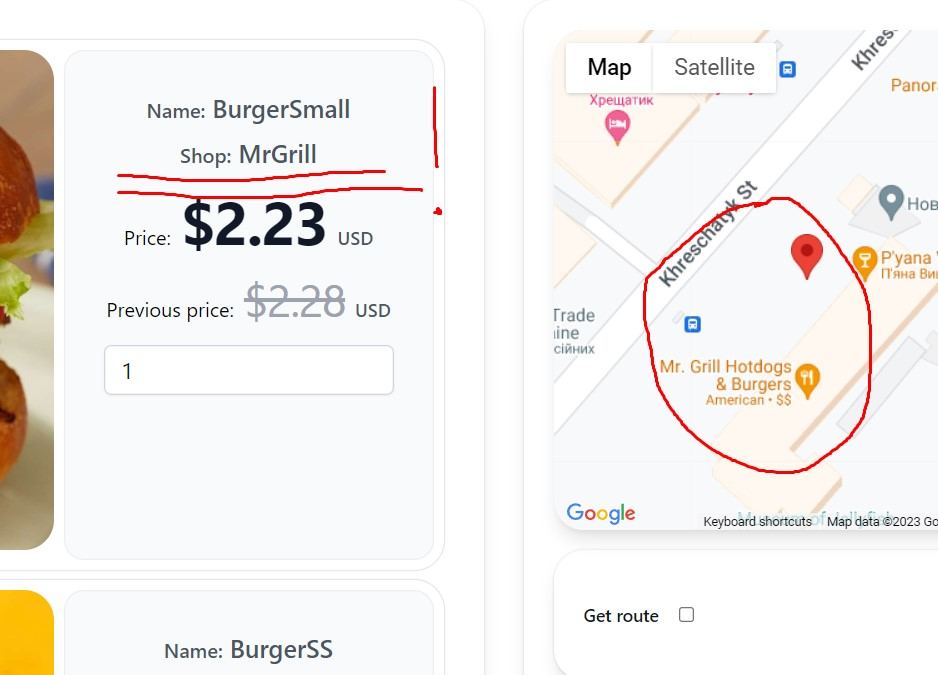
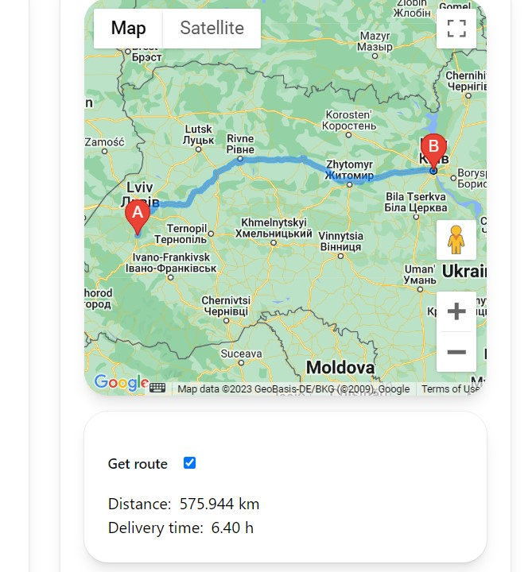
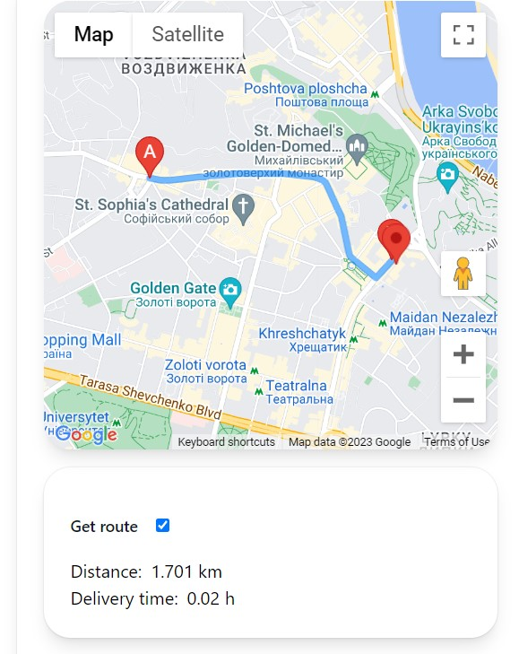
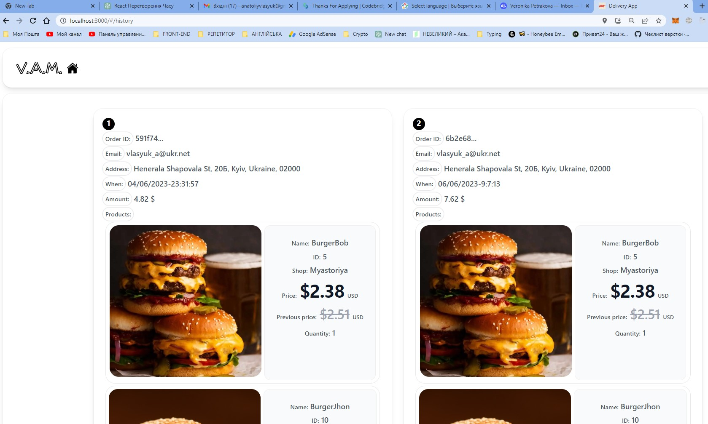
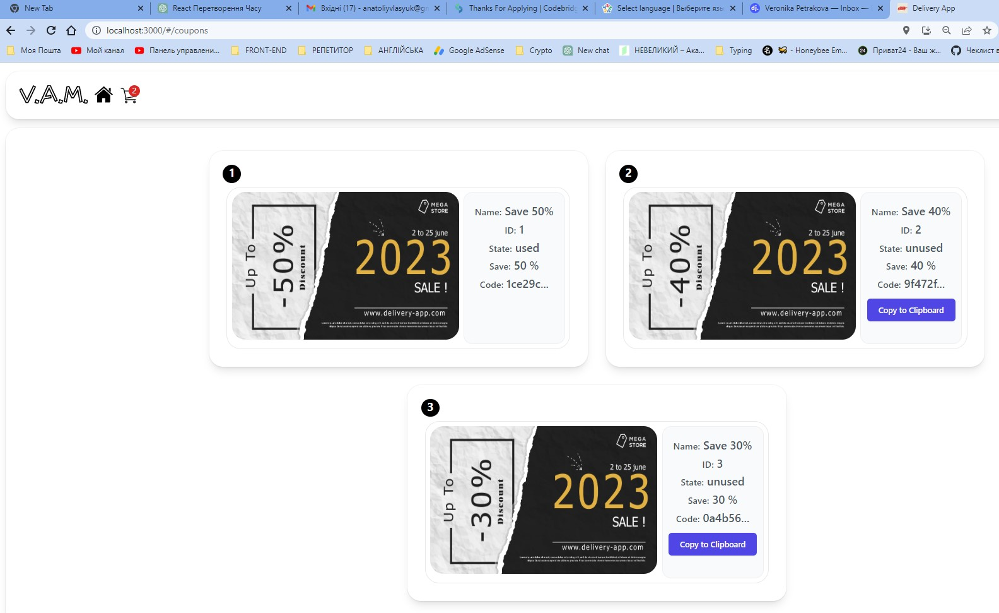
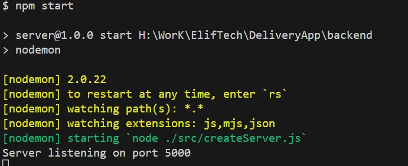
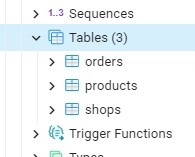

<br/>
<p align="center">
  

  <h3 align="center">Delivery App</h3>

  <p align="center">
    <a href="http://ec2-3-252-200-218.eu-west-1.compute.amazonaws.com">View Demo</a>
    </br>
    <a href="https://www.loom.com/share/27e214f9cb6c4d89907eee1a4db49a6a">View Video Demo</a>
  </p>
</p>


## Table Of Contents

* [About the Project](#about-the-project)
* [Built With](#built-with)
* [Getting Started](#getting-started)
  * [Installation Client](#installation-client)
  * [Installation Server](#installation-server)
  * [Installation DataBase](#installation-database)
* [Features of development](#features-of-development)
* [Deployment](#deployment)
* [Author](#author)

## About The Project



The Delivery App consists four basic pages:
* Home Page
* Cart Page
* History Page
* Coupons Page

On the Home page users can choose a shop, then add goods to the cart (data will be gotten from the database).



On the Cart Page the user can check all added products, change the count. 



And add an email, a phone number, and an address (in
inputs). The order will be saved in the database after the user clicks the “submit” button, which will appear after verification captcha. Also, the user can apply coupons on discount.

Users can order products only from one shop. For example, if the user chooses McDonald's, the cart will be cleared, and so on.

Users can choose their address using a marker on the map. The user should grab the marker and move it in  a place which is needed and let it go. The needed address will appear in an appropriate input field.

When the user choosed products and opened Cart Page, initially the marker places in a point, which has coordinates of choosed shop.



The App shows route from shop to user’s address and approximately time (in hours) of delivering.




Users can find their orders on History Page.



Users can see all coupons (coupons will be used for
discounts, users can apply them on the shopping cart page)



One coupon the user can use one time!

## Built With
The application has 3 parts:
* Client
* Server
* Database

 Client was created by using:
<h5 align="left">Languages, Frameworks and Tools:</h5>

<p align="left">
<a href="https://aws.amazon.com" target="_blank" rel="noreferrer">  </a>
<a href="https://www.gnu.org/software/bash/" target="_blank" rel="noreferrer"> 
 </a> 
<a href="https://www.w3schools.com/css/" target="_blank" rel="noreferrer">  </a> 
<a href="https://git-scm.com/" target="_blank" rel="noreferrer"> </a>
<a href="https://www.w3.org/html/" target="_blank" rel="noreferrer"> </a> 
<a href="https://developer.mozilla.org/en-US/docs/Web/JavaScript" target="_blank" rel="noreferrer"> </a> 
<a href="https://nodejs.org" target="_blank" rel="noreferrer"> </a>
<a href="https://postman.com" target="_blank" rel="noreferrer"></a> 
<a href="https://reactjs.org/" target="_blank" rel="noreferrer"> </a> 
<a href="https://redux.js.org" target="_blank" rel="noreferrer"> </a> 
<a href="https://sass-lang.com" target="_blank" rel="noreferrer">  </a> <a href="https://www.typescriptlang.org/" target="_blank" rel="noreferrer"> </a> 
<a href="https://webpack.js.org" target="_blank" rel="noreferrer"> </a> 
<a href="https://tailwindcss.com/" target="_blank" rel="noreferrer"> </a> 
</p>


 Server was created by using:
<h5 align="left">Languages, Frameworks and Tools:</h5>
<p align="left"> 
<a href="https://aws.amazon.com" target="_blank" rel="noreferrer"> </a> 
<a href="https://www.gnu.org/software/bash/" target="_blank" rel="noreferrer"> </a> 
<a href="https://expressjs.com" target="_blank" rel="noreferrer"></a> 
<a href="https://git-scm.com/" target="_blank" rel="noreferrer"></a> 
<a href="https://developer.mozilla.org/en-US/docs/Web/JavaScript" target="_blank" rel="noreferrer"> </a> 
<a href="https://www.linux.org/" target="_blank" rel="noreferrer"> </a> 
<a href="https://nodejs.org" target="_blank" rel="noreferrer">  </a> <a href="https://www.postgresql.org" target="_blank" rel="noreferrer">  </a> <a href="https://postman.com" target="_blank" rel="noreferrer">  </a></p>

 DataBase was created by using:
<h5 align="left">Languages, Frameworks and Tools:</h5>

<p align="left"> 
<a href="https://aws.amazon.com" target="_blank" rel="noreferrer"> </a> 
<a href="https://developer.mozilla.org/en-US/docs/Web/JavaScript" target="_blank" rel="noreferrer"></a> 
<a href="https://www.linux.org/" target="_blank" rel="noreferrer"></a> 
<a href="https://nodejs.org" target="_blank" rel="noreferrer">  </a> <a href="https://www.postgresql.org" target="_blank" rel="noreferrer"> </a></p>


## Getting Started

To get a local copy up and running follow these simple example steps.

### Installation Client

1. Clone the repo

```sh
git clone https://github.com/vlasiuk-anatolii/delivery-app
```
2. Go to frontend folder 
```sh
cd frontend
```
3. Install NPM packages

```sh
npm install
```
4. Type in the terminal

```sh
npm start
```
5. After that, client will start on http://localhost:3000

### Installation Server

1. If cloned repo: https://github.com/vlasiuk-anatolii/delivery-app

2. Go to backend folder 
```sh
cd backend
```

3. Install NPM packages

```sh
npm install
```
4. Type in the terminal

```sh
npm start
```

5. After that, you should see:



6. It means, that your server is started.

### Installation DataBase

1. File for restore db db.sql exists in the folder db which you will get when cloned repo https://github.com/vlasiuk-anatolii/delivery-app

2. Install on your computer PostgreSQL.

3. Creat empty database with name Products.
4. You should used utility of PostgreSQL such as pg_restore and restore data base with specified name.
5. Restored database must consists 3 tables: 'shops', 'products', 'orders'.



6. If you reached this, it means that your have done all steps well.

You can use system!

## Features of development

 The server interacts with database through ORM "Sequelize". Sequelize escapes replacements, which avoids the problem SQL injection attacks.

 The server was implemented by using MVC architectural pattern.

 In accordance with the policy of CORS was used cors node.js package.


## Deployment
Was choosed a place for deploy - AWS.
Was created instance on EC2 service.
All elements of project were migrated from Windows platform to Ubuntu

## Author

* **Vlasiuk Anatolii** - [Vlasiuk Anatolii](https://github.com/vlasiuk-anatolii) - *Delivery App*
